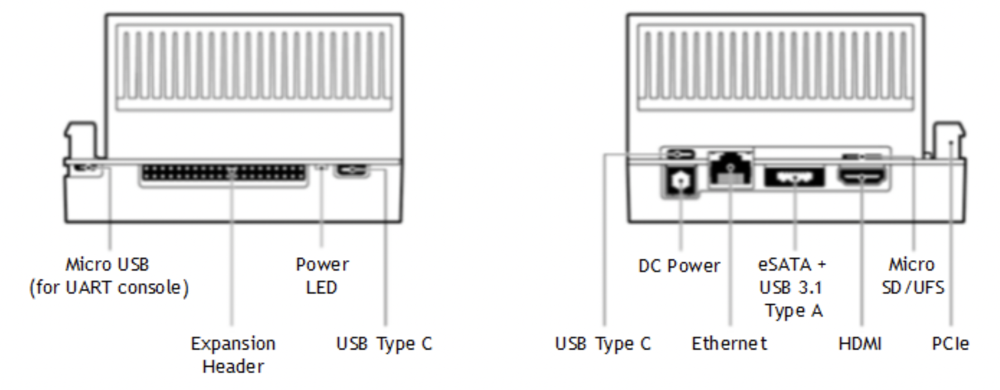
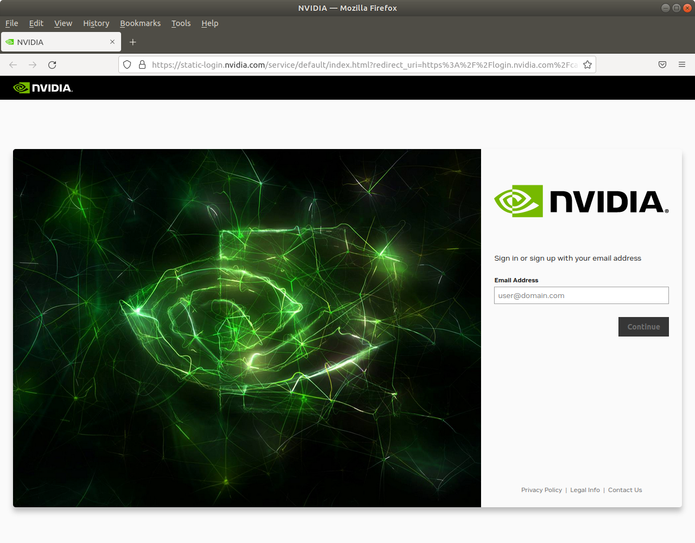
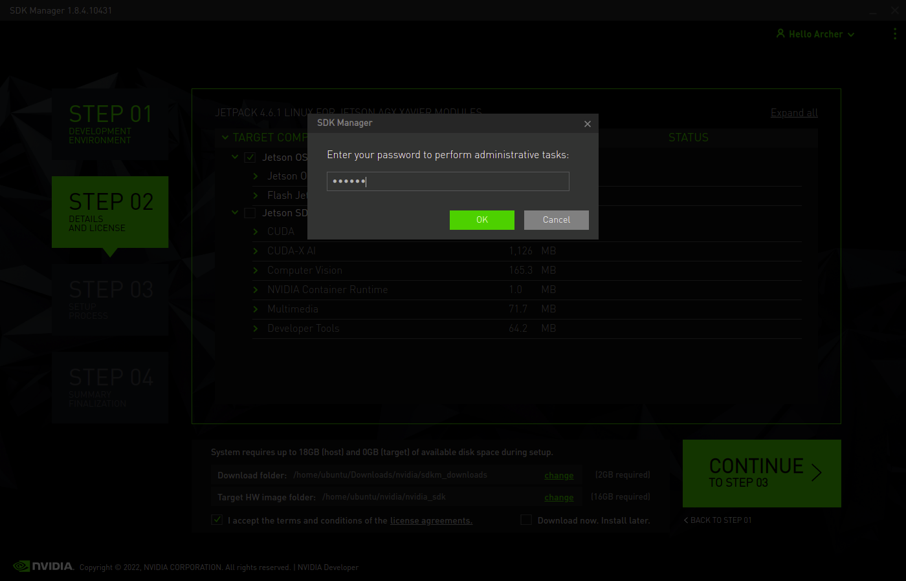

# NVIDIA Xavier Backup & Restore

## Contents
- [Prerequisites](#prerequisites)
- [NVIDIA Xavier - front view ( left ) & rear view ( right )](#nvidia-xavier---front-view--left---rear-view--right-)
- [Physical Connection](#physical-connection)
- [Ubuntu HOST PC Setup Process](#ubuntu-host-pc-setup-process)
- [Backup the image of Jetson AGX Xavier](#backup-the-image-of-jetson-agx-xavier)
- [Restore Custom Image to NVIDIA Jetson AGX Xavier](#restore-custom-image-to-nvidia-jetson-agx-xavier)
- [License](#license)
- [Reference](#reference)

## Prerequisites
* Make sure you have all of the following prerequisites：
  * Host computer with [Ubuntu 18.04 LTS Desktop](https://releases.ubuntu.com/18.04/) - 1 pc
  * [NVIDIA® Jetson AGX Xavier™](https://developer.nvidia.com/embedded/jetson-agx-xavier-developer-kit) ( Internet Connection ) - 1 pc
  * AC Adapter for NVIDIA® Jetson AGX Xavier™ - 1 pc
  * USB Type-C to Type-A Cable for NVIDIA® Jetson AGX Xavier™ & PC - 1 pc
  * HDMI Monitor for NVIDIA® Jetson AGX Xavier™ & PC - 2 pcs
  * HDMI Cable for NVIDIA® Jetson AGX Xavier™ & PC - 2 pcs
  * USB keyboard & mouse for NVIDIA® Jetson AGX Xavier™ & PC - 2 pcs

|           Device           | Ubuntu 18.04 LTS | AC Adapter | USB Type-C to Type-A Cable | HDMI Monitor | HDMI Cable | USB keyboard & mouse |
|:--------------------------:|:----------------:|:----------:|:--------------------------:|:------------:|:----------:|:--------------------:|
|           Host PC          |         ●        |            |              ●             |       ●      |      ●     |           ●          |
| NVIDIA® Jetson AGX Xavier™ |                  |      ●     |              ●             |       ●      |      ●     |           ●          |

## NVIDIA Xavier - front view ( left ) & rear view ( right )


## Physical Connection


## Ubuntu HOST PC Setup Process
【 Step 1 】 Copy `sdkmanager_1.8.4-10431_amd64.deb` to `~`
* Enter the following command in the HOST terminal.
```
cp sdkmanager_1.8.4-10431_amd64.deb ~
```

【 Step 2 】 Install NVIDIA SDK Manager
* Enter the following command in the HOST terminal.
```
sudo apt update
sudo apt install -y ./sdkmanager_1.8.4-10431_amd64.deb
```

【 Step 3 】 Open NVIDIA SDK Manager
* Enter the following command in the HOST terminal.
```
sdkmanager
```

【 Step 4 】Install Jetson OS
* Click `LOGIN` Button


* Input `Email Address`


* Input `Password` or Click `More Login Options`


* Click `Log in with Google`


* Input `Google Account`


* Input `Authenticator Code`


* Login Success


* Click `No, disable usage collection`


* Click `OK`


* Select Items
  * `PRODUCT CATEGORY` field
    * Select `Jetson`
  * `Target Hardware` field 
    * Select `Jetson AGX XAVIER modules`
  * `TARGET OPERATING SYSTEM` field
    * Select `Linux JetPack 4.6.1`
  * When the input is complete, please click `CONTINUE` button.


* Wait for the request to process


* Click `Create`


* Input `sudo password`


* Click `OK`


* Wait for the request to process


* Click `Skip`


* Finish


## Backup the image of Jetson AGX Xavier
【 Step 1 】 Connect Ubuntu PC to NVIDIA Jetson AGX Xavier
* Ref [Physical Connection](#physical-connection)

【 Step 2 】 Change NVIDIA® Jetson AGX Xavier™ Mode
* Press and Hold the `Power Button` and `Force Recovery Button`, now Wait for `5 second` and Release the `Power Button` and `Force Recovery Button`.

【 Step 3 】 Check Connect Status
* Enter the following command in the HOST terminal. If connected, you'll see the device name listed as a `NVidia Corp.`
```
lsusb
```


【 Step 4 】 Changing to another directory
* Enter the following command in the HOST terminal.
```
cd ~/nvidia/nvidia_sdk/JetPack_4.6.1_Linux_JETSON_AGX_XAVIER_TARGETS/Linux_for_Tegra
```

【 Step 5 】 Create Custom Image
* Enter the following command in the HOST terminal. If command executed successfully, you'll see the `backup.img` and `backup.img.raw` in `~/nvidia/nvidia_sdk/JetPack_4.6.1_Linux_JETSON_AGX_XAVIER_TARGETS/Linux_for_Tegra`
```
sudo ./flash.sh -r -k APP -G backup.img jetson-xavier mmcblk0p1
```

【 Step 6 】 Rename `backup.img` to `system.img` in `~/nvidia/nvidia_sdk/JetPack_4.6.1_Linux_JETSON_AGX_XAVIER_TARGETS/Linux_for_Tegra`

## Restore Custom Image to NVIDIA Jetson AGX Xavier
【 Step 1 】Copy `system.img` to `~/nvidia/nvidia_sdk/JetPack_4.6.1_Linux_JETSON_AGX_XAVIER_TARGETS/Linux_for_Tegra/bootloader`

【 Step 2 】Connect Ubuntu PC to NVIDIA Jetson AGX Xavier
* Ref [Physical Connection](#physical-connection)

【 Step 3 】Change NVIDIA® Jetson AGX Xavier™ Mode
* Press and Hold the `Power Button` and `Force Recovery Button`, now Wait for `5 second` and Release the `Power Button` and `Force Recovery Button`.


【 Step 4 】Check Connect Status
* Enter the following command in the HOST terminal. If connected, you'll see the device name listed as a `NVidia Corp.`
```
lsusb
```


【 Step 5 】Changing to another directory
* Enter the following command in the HOST terminal.
```
cd ~/nvidia/nvidia_sdk/JetPack_4.6.1_Linux_JETSON_AGX_XAVIER_TARGETS/Linux_for_Tegra
```

【 Step 6 】Restore custom image
* Enter the following command in the HOST terminal.
```
sudo ./flash.sh -r jetson-xavier mmcblk0p1
```

## License
This sample is licensed under the [MIT](./LICENSE) license.

## Reference
* https://developer.nvidia.com/nvidia-sdk-manager
* https://developer.nvidia.com/embedded/jetpack-sdk-46#collapseAllJetson
* https://releases.ubuntu.com/18.04/